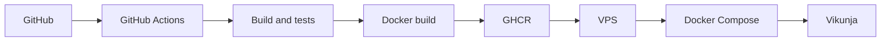

# Учебный CI/CD и развертывание Vikunja

Эта конфигурация изолирована от основных workflow Vikunja. Она собирает и тестирует код fork-репозитория, создает из того же commit собственный Docker image и запускает этот image на VPS. Приложение на VPS не компилируется.



## Что выполняет pipeline

Workflow `.github/workflows/student-ci-cd.yml` запускается для pull request в `main` и push в `main`.

- CI для pull request и push: сборка frontend командой `pnpm build`, сборка backend командой `mage build`, backend-тесты `mage test:feature` и `mage test:web`, frontend unit-тесты `pnpm test:unit`.
- Публикация только для push в `main`: штатный корневой `Dockerfile` создает image текущего commit, после чего image публикуется в GHCR с тегами `latest` и SHA commit.
- CD только после успешной публикации: GitHub Actions подключается к VPS по SSH, выполняет `docker compose pull`, `docker compose up -d` и удаляет неиспользуемые образы.

Зависимости jobs заданы как `test -> docker -> deploy`, поэтому ошибка сборки или тестов блокирует публикацию и развертывание.

## GitHub Secrets

В `Settings -> Secrets and variables -> Actions` fork-репозитория создайте repository secrets:

- `VPS_HOST` — публичный IP или DNS-имя VPS;
- `VPS_USER` — непривилегированный пользователь для SSH;
- `VPS_SSH_KEY` — полный текст отдельного приватного SSH-ключа, публичная часть которого добавлена на VPS в `~/.ssh/authorized_keys`.

`GITHUB_TOKEN` создавать вручную не нужно. GitHub выдает его job автоматически; workflow запрашивает только `packages: write` для публикации в GHCR.

## Подготовка Ubuntu VPS

Сначала проверьте версию и архитектуру системы:

```bash
. /etc/os-release
echo "$PRETTY_NAME ($VERSION_CODENAME)"
dpkg --print-architecture
```

Docker Engine официально поддерживает актуальные 64-битные Ubuntu LTS. Для поддерживаемой версии подключите официальный apt-репозиторий Docker:

```bash
sudo apt update
sudo apt install -y ca-certificates curl
sudo install -m 0755 -d /etc/apt/keyrings
sudo curl -fsSL https://download.docker.com/linux/ubuntu/gpg -o /etc/apt/keyrings/docker.asc
sudo chmod a+r /etc/apt/keyrings/docker.asc

sudo tee /etc/apt/sources.list.d/docker.sources >/dev/null <<EOF
Types: deb
URIs: https://download.docker.com/linux/ubuntu
Suites: $(. /etc/os-release && echo "${UBUNTU_CODENAME:-$VERSION_CODENAME}")
Components: stable
Architectures: $(dpkg --print-architecture)
Signed-By: /etc/apt/keyrings/docker.asc
EOF

sudo apt update
apt-cache policy docker-ce
```

В выводе `apt-cache policy docker-ce` должна появиться строка `Candidate` с версией, а не `(none)`. После этого установите Docker Engine и Compose plugin:

```bash
sudo apt install -y docker-ce docker-ce-cli containerd.io docker-buildx-plugin docker-compose-plugin
sudo systemctl enable --now docker
docker compose version
```

Добавьте пользователя развертывания в группу `docker`, затем переподключитесь по SSH:

```bash
sudo usermod -aG docker "$USER"
```

Создайте структуру развертывания. Контейнер из штатного `Dockerfile` работает с UID/GID `1000`, поэтому каталоги данных должны быть ему доступны:

```bash
sudo mkdir -p /opt/vikunja/deploy/data/db /opt/vikunja/deploy/data/files
sudo chown -R "$USER":"$USER" /opt/vikunja
sudo chown -R 1000:1000 /opt/vikunja/deploy/data
```

Скопируйте `deploy/docker-compose.yml` и `deploy/.env.example` из репозитория в `/opt/vikunja/deploy`, затем создайте рабочий env-файл:

```bash
cd /opt/vikunja/deploy
cp .env.example .env
nano .env
```

Замените в `.env`:

- `GHCR_OWNER` на владельца fork-репозитория в GitHub, обязательно в нижнем регистре (например, `ahrimat`);
- `SERVER_IP` в `VIKUNJA_PUBLIC_URL` на публичный IP или DNS VPS;
- `VIKUNJA_SERVICE_SECRET` на результат `openssl rand -hex 32`.

Оставьте завершающий `/` в public URL. Порт `3456/tcp` должен быть разрешен в firewall VPS и у хостинг-провайдера, например при использовании UFW:

```bash
sudo ufw allow 3456/tcp
```

## Доступ к GHCR

Самый простой вариант для учебного развертывания — сделать опубликованный package `vikunja` публичным в настройках Packages на GitHub. Тогда VPS сможет выполнять pull без учетных данных.

Если package остается приватным, создайте GitHub Personal Access Token **(classic)** с правом `read:packages`. Выполните вход от пользователя развертывания без `sudo`, чтобы credentials сохранились для него:

```bash
read -rsp 'GitHub PAT: ' CR_PAT && echo
printf '%s' "$CR_PAT" | docker login ghcr.io -u YOUR_GITHUB_USER --password-stdin
unset CR_PAT
```

Не используйте пароль GitHub или fine-grained token: GHCR требует PAT classic. Не сохраняйте token в репозитории или `.env` проекта. Команда выше не выводит token и не записывает его в историю shell.

## Первый запуск и проверка

До включения автоматического deploy выполните первый запуск вручную:

```bash
cd /opt/vikunja/deploy
docker compose config
docker compose pull
docker compose up -d
docker compose ps
docker compose logs --tail=100 vikunja
```

Откройте `http://SERVER_IP:3456` в браузере. Для непрерывного просмотра логов используйте:

```bash
docker compose logs -f vikunja
```

SQLite хранится в `/opt/vikunja/deploy/data/db`, загруженные файлы — в `/opt/vikunja/deploy/data/files`. Эти каталоги переживают замену контейнера и должны резервироваться вместе.

## Как проверить pipeline без реального deploy

Сначала создайте ветку и pull request в `main`. Для события `pull_request` запускается только job `test`; jobs `docker` и `deploy` будут пропущены. После успешной проверки подготовьте VPS и Secrets, затем merge/push в `main` запустит всю цепочку.

Не отправляйте push в `main`, пока VPS и три Secrets не готовы: после публикации image job `deploy` попытается подключиться по SSH.

## Дальнейшие развертывания

Каждый успешный push в `main` проходит сборку и тесты. Затем новый image получает теги SHA и `latest`. VPS скачивает новый `latest` и пересоздает только контейнер Vikunja; данные остаются в bind mounts. SHA-тег позволяет вручную откатиться: укажите нужный SHA в `VIKUNJA_TAG` файла `.env` и выполните `docker compose pull && docker compose up -d`.

## Ограничения учебной конфигурации

- Публичный HTTP на порту 3456 не шифрует трафик. Для учебного этапа это допустимо, но для реальной эксплуатации нужен HTTPS reverse proxy.
- SQLite подходит для одного экземпляра и небольшой нагрузки; несколько реплик с общей SQLite базой запускать нельзя.
- `latest` удобен для автоматического deploy, а воспроизводимый ручной запуск следует делать по SHA-тегу.
- `docker image prune -f` удаляет только неиспользуемые dangling images; он не затрагивает работающий контейнер и persistent data.
- Workflow использует репозиторные тесты для SQLite по умолчанию, но не дублирует всю большую матрицу баз данных и E2E из основного CI Vikunja.
